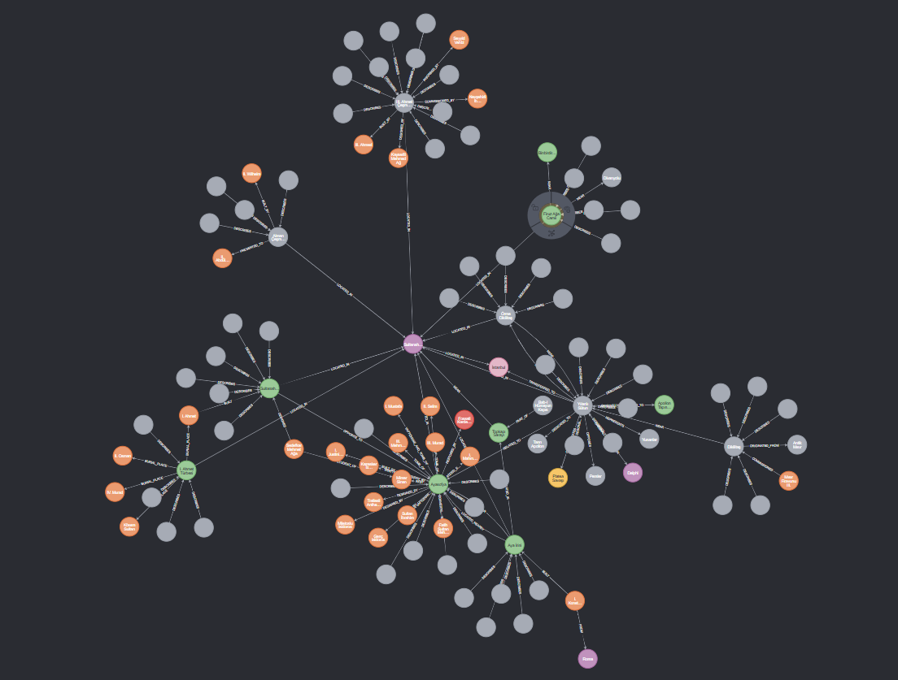
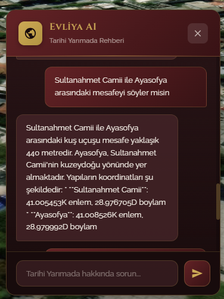

# GraphRAG — Tarihi Yarımada Chatbot Motoru

Tarihi yapılar haritada birer nokta olarak temsil edilir; ancak bir yapının kendi tarihini, çevresindeki yapılarla ilişkisini ve uzamsal bağlamını anlamlandırması farklı bir problemi işaret eder. Bu proje, yapılara uzamsal bir farkındalık kazandırmayı amaçlar.

Neo4j ile oluşturulmuş bu graphrag projesi, vektör araması ve Gemini 2.5 Flash modelini birleştirerek İstanbul Tarihi Yarımada'daki yapılar hakkındaki hem tarihsel hem uzamsal soruları Türkçe olarak yanıtlayan bir sistem.

---

## Ekran Görüntüleri

| Neo4j Graf Görünümü | Chatbot Arayüzü |
|---|---|
|  |  |

---

## Nasıl Çalışır?

```
Kullanıcı Sorusu
       │
       ▼
  QueryAnalyzer       →  Niyet tespiti + varlık çıkarımı
       │
       ├── Mekansal mı?  →  Haversine ile mesafe & yön hesabı
       │
       ▼
  HybridRetriever
  ├── VectorRetriever   →  Sentence Transformers + Neo4j vektör indeksi
  └── GraphRetriever    →  Cypher ile graf gezintisi (3 hop)
       │
       └── RRF ile birleştirme
       │
       ▼
  ResponseGenerator     →  Google Gemini → Türkçe yanıt
```

Klasik RAG'dan farkı: Graf gezintisi sayesinde tek bir yapı hakkında anlık bilginin ötesinde — "aynı dönemde inşa edilenler", "aynı mimarın eserleri" gibi ilişkisel sorular da yanıtlanabilir. Mekansal sorgularda (iki yapı arası mesafe ve yön) ise koordinatlar Neo4j'den alınarak çalışma zamanında hesaplanır.

---

## Örnek Sorgular

```
S: Ayasofya'yı kim yaptırdı?
C: Ayasofya, Bizans İmparatoru I. Justinianus tarafından 532-537 yılları
   arasında inşa ettirilmiştir.

S: Dikilitaş ile Yılanlı Sütun arasındaki mesafe nedir?
C: Dikilitaş ile Yılanlı Sütun arasındaki kuş uçuşu mesafe yaklaşık 45
   metredir. Yılanlı Sütun, Dikilitaş'ın güneybatı yönündedir.
```

---

## Veri Seti

`son-veri/` dizinindeki 10 yapıya ait Türkçe metin dosyaları işlenerek Neo4j grafına aktarılmıştır: Ayasofya, Sultanahmet Camii, Dikilitaş, Yılanlı Sütun, Örme Dikilitaş, Aya İrini, III. Ahmet Çeşmesi, Alman Çeşmesi, I. Ahmet Türbesi, Firuzağa Camii.

---

## Teknolojiler

- **Neo4j** — Graf veritabanı + vektör indeksi
- **Sentence Transformers** — Çok dilli embedding (`paraphrase-multilingual-MiniLM-L12-v2`)
- **Google Gemini** — Yanıt üretimi
- **LangChain** — LLM orkestrasyon
- **FastAPI** — REST API

---

## Kurulum

Detaylar için [CALISTIRMA.md](CALISTIRMA.md) dosyasına bakın. Kısaca:

```bash
python -m venv .venv && .venv\Scripts\activate
pip install -r requirements.txt
# .env dosyasını doldurun (GOOGLE_API_KEY, NEO4J_PASSWORD)
docker compose up -d
python -m uvicorn api:app --host 0.0.0.0 --port 8002
```

---

## Lisans

MIT
